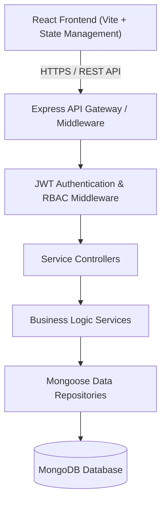

# 📚 Library Management System (LMS) — MERN Stack

[](https://nodejs.org/)
[](https://expressjs.com/)
[](https://react.dev/)
[](https://www.mongodb.com/)
[](LICENSE)

An enterprise-grade, scalable **Library Management System (LMS)** built on the **MERN** (MongoDB, Express, React, Node.js) stack. Designed to automate book circulation, user memberships, reservations, penalty/fine tracking, and library administration with role-based access control (RBAC).

---

## 📑 Table of Contents

- [Features](#-features)
- [System Architecture](#-system-architecture)
- [Tech Stack](#-tech-stack)
- [Project Directory Structure](#-project-directory-structure)
- [Getting Started](#-getting-started)
  - [Prerequisites](#prerequisites)
  - [Installation](#installation)
  - [Environment Variables](#environment-variables)
- [API Endpoints Overview](#-api-endpoints-overview)
- [Database Schema Outline](#-database-schema-outline)
- [Security & Best Practices](#-security--best-practices)
- [Roadmap](#-roadmap)
- [Contributing](#-contributing)
- [License](#-license)

---

## 🌟 Features

### 📖 Catalog & Book Management
- Full CRUD operations on books (ISBN, Title, Author, Genre, Publication Year, Copies, Rack/Shelf Location).
- Real-time stock status (Available, Borrowed, Reserved, Lost/Damaged).
- Advanced multi-criteria search and filtering (by author, category, ISBN, or availability).
- Cover image uploads and barcode/QR code generation support.

### 👥 Member & Role Management
- **Role-Based Access Control (RBAC)**:
  - **Admin**: Full system access, audit logs, librarian management, system configurations.
  - **Librarian**: Book inventory management, issue/return processing, fine collection.
  - **Member (Student/Patron)**: Search catalog, view borrow history, reserve titles, check active fines.
- User profile management with digital library membership card generation.

### 🔄 Circulation (Issue, Return & Renewals)
- Seamless book issue and return workflows with due date tracking.
- Automated overdue notifications and fine calculation engine.
- Book reservation and queue allocation when books become available.
- Renewal policies based on member tier.

### 📊 Analytics & Reporting
- Executive dashboard with key metrics: Total Books, Active Borrows, Overdue Returns, Revenue from Fines.
- Circulation trends, top borrowed genres, and most popular titles.
- Export reports to CSV/PDF.

---

## 🏗️ System Architecture



---

## 🛠️ Tech Stack

| Layer | Technology | Purpose |
| :--- | :--- | :--- |
| **Frontend** | React 18+, Vite | High-performance SPA with modern tooling |
| **Styling** | Modern CSS / Design Tokens | Responsive, accessible, theme-aware UI |
| **State Management** | Context API / Redux Toolkit | Predictable client state |
| **Backend** | Node.js, Express.js | Robust RESTful API service |
| **Database** | MongoDB & Mongoose | Flexible NoSQL document database with strict schema validation |
| **Authentication** | JSON Web Tokens (JWT) & bcrypt | Secure stateless auth & password hashing |
| **Validation** | Zod / Joi | Centralized request payload validation |

---

## 📂 Project Directory Structure

```text
library-management-system/
├── client/                     # React Frontend Application
│   ├── public/                 # Static public assets
│   ├── src/
│   │   ├── assets/             # Icons, images, illustrations
│   │   ├── components/         # Atomic reusable UI components (Buttons, Inputs, Modals)
│   │   ├── features/           # Feature-driven modules (books, borrows, users, analytics)
│   │   ├── hooks/              # Custom React hooks
│   │   ├── layouts/            # Dashboard, Auth, and Public layouts
│   │   ├── routes/             # Protected and public route definitions
│   │   ├── services/           # Centralized Axios API service layer
│   │   ├── styles/             # Design tokens, variables, and global CSS
│   │   ├── App.jsx             # Root component
│   │   └── main.jsx            # Entry point
│   ├── index.html
│   ├── package.json
│   └── vite.config.js
│
├── server/                     # Express.js Backend Application
│   ├── src/
│   │   ├── config/             # DB connection, CORS, and env configurations
│   │   ├── constants/          # Application roles, error codes, HTTP statuses
│   │   ├── controllers/        # Request/Response handlers
│   │   ├── middlewares/        # Auth, RBAC, error handling, rate limiting
│   │   ├── models/             # Mongoose schemas (Book, User, Borrow, Fine)
│   │   ├── repositories/       # Database query abstraction layer
│   │   ├── routes/             # Centralized route definitions
│   │   ├── services/           # Core business logic
│   │   ├── utils/              # Helper functions, logger, response wrappers
│   │   ├── validations/        # Payload schema validation schemas
│   │   ├── app.js              # Express app setup
│   │   └── server.js           # Server bootstrap & listener
│   ├── package.json
│   └── .env.example
│
├── docs/                       # Architecture diagrams, API specs, workflows
├── .gitignore                  # Root git exclusion rules
└── README.md                   # Project documentation
```

---

## 🚀 Getting Started

### Prerequisites
- **Node.js**: `v18.x` or higher installed ([Download Node.js](https://nodejs.org/))
- **npm** or **yarn** or **pnpm**
- **MongoDB**: Local instance running on `mongodb://localhost:27017` or a [MongoDB Atlas](https://www.mongodb.com/atlas) connection URI

### Installation

1. **Clone the repository:**
   ```bash
   git clone https://github.com/your-username/library-management-system.git
   cd library-management-system
   ```

2. **Setup Server:**
   ```bash
   cd server
   npm install
   cp .env.example .env
   # Edit .env with your credentials
   npm run dev
   ```

3. **Setup Client:**
   ```bash
   cd ../client
   npm install
   npm run dev
   ```

4. **Access the application:**
   - Frontend: `http://localhost:5173`
   - Backend API: `http://localhost:5000/api/v1`

---

## 🔐 Environment Variables

### Server (`server/.env`)
```env
PORT=5000
NODE_ENV=development
CLIENT_URL=http://localhost:5173
MONGODB_URI=mongodb://localhost:27017/library_management_db
JWT_SECRET=your_super_secret_jwt_key_change_in_production
JWT_EXPIRES_IN=7d
FINE_RATE_PER_DAY=1.50
DEFAULT_BORROW_DAYS=14
```

### Client (`client/.env`)
```env
VITE_API_BASE_URL=http://localhost:5000/api/v1
```

---

## 📡 API Endpoints Overview

All endpoints are versioned under `/api/v1`.

### 🔑 Authentication (`/api/v1/auth`)
| Method | Endpoint | Access | Description |
| :--- | :--- | :--- | :--- |
| `POST` | `/register` | Public | Register a new member account |
| `POST` | `/login` | Public | Authenticate user and receive JWT |
| `GET` | `/me` | Private | Retrieve current user profile |

### 📚 Books Catalog (`/api/v1/books`)
| Method | Endpoint | Access | Description |
| :--- | :--- | :--- | :--- |
| `GET` | `/` | Public | Search & list all books with pagination |
| `GET` | `/:id` | Public | Retrieve single book details |
| `POST` | `/` | Admin / Librarian | Add a new book to catalog |
| `PUT` | `/:id` | Admin / Librarian | Update book information / stock count |
| `DELETE`| `/:id` | Admin | Remove book from catalog |

### 🔄 Circulation & Borrows (`/api/v1/borrows`)
| Method | Endpoint | Access | Description |
| :--- | :--- | :--- | :--- |
| `POST` | `/issue` | Librarian / Admin | Issue a book to a member |
| `POST` | `/return/:borrowId` | Librarian / Admin | Process return and compute fine |
| `GET` | `/my-borrows` | Member | View logged-in user's borrow history |
| `GET` | `/overdue` | Librarian / Admin | Fetch list of all overdue books |

---

## 🗄️ Database Schema Outline

- **Users**: `name`, `email`, `passwordHash`, `role` (`ADMIN`, `LIBRARIAN`, `MEMBER`), `phone`, `membershipStatus`, `activeLoansCount`.
- **Books**: `title`, `author`, `isbn`, `genre`, `availableCopies`, `totalCopies`, `rackNumber`, `publishedYear`, `status`.
- **Borrows**: `bookId`, `userId`, `issuedBy`, `issueDate`, `dueDate`, `returnDate`, `status` (`ISSUED`, `RETURNED`, `OVERDUE`), `fineAmount`, `finePaid`.

---

## 🛡️ Security & Best Practices

- **Password Hashing**: Salted hashing via `bcryptjs`.
- **JWT Protection**: Tokens verified via middleware with expiration checks.
- **Data Sanitization & Validation**: Inputs validated prior to hitting database layers to prevent injection attacks.
- **Security Headers**: Production-ready HTTP security headers using `helmet`.
- **CORS Configuration**: Restricts origin requests strictly to the configured client domain.
- **Centralized Error Handling**: Unified standard JSON error response across all API routes.

---

## 🗺️ Roadmap

- [ ] Automated email reminders for overdue books.
- [ ] Barcode scanning support using device camera.
- [ ] Payment gateway integration for online fine clearance (Stripe / Razorpay).
- [ ] E-book download and digital reader integration.

---

## 🤝 Contributing

Contributions, issues, and feature requests are welcome! Feel free to check the [issues page](https://github.com/your-username/library-management-system/issues).

1. Fork the Project
2. Create your Feature Branch (`git checkout -b feature/AmazingFeature`)
3. Commit your Changes (`git commit -m 'Add some AmazingFeature'`)
4. Push to the Branch (`git push origin feature/AmazingFeature`)
5. Open a Pull Request

---

## 📄 License

Distributed under the MIT License. See `LICENSE` for more details.
